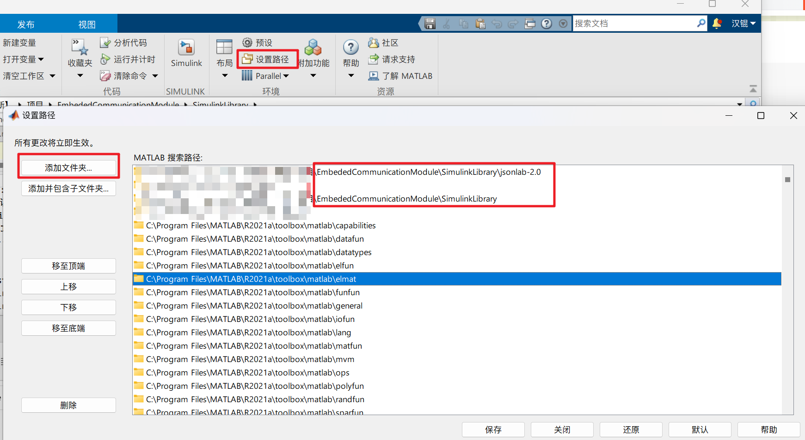
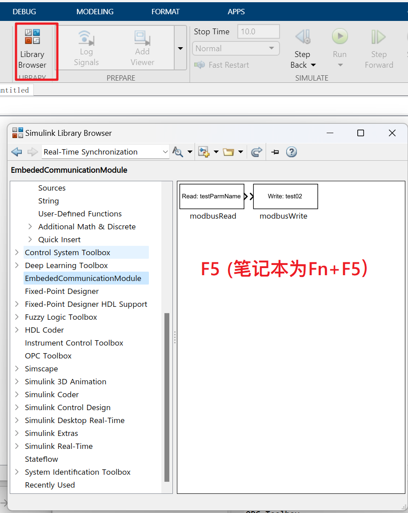
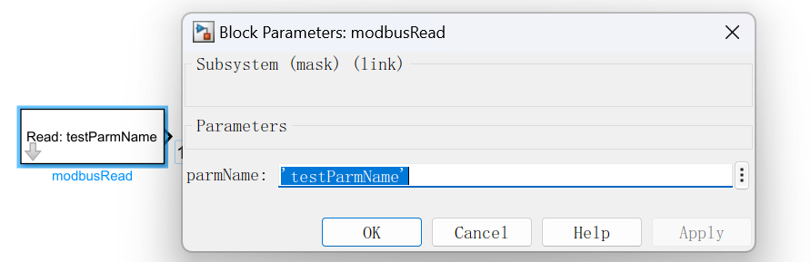
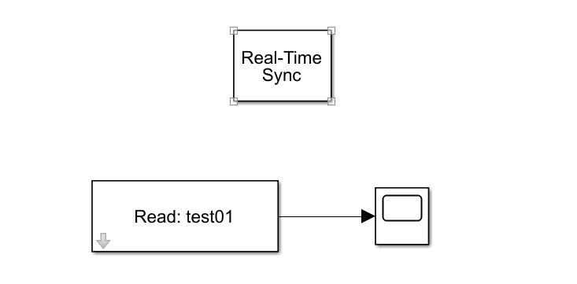

# Embeded Communication Module：Simulink与多个嵌入式设备的交互系统

## 01. 简介

你可以使用本项目，自动生成多个嵌入式设备和Simulink代码，快速构建Simulink和多个嵌入式设备的交互程序。一些典型的应用如下：

- 舵机控制：通过Simulink执行算法，连接Arduino执行
- 便携数据采集设备（./Example/ESP32_PlatformIO_Arduino)：通过Arduino采集相关传感器的信息，并自动发送到Simulink中，构建上位机系统

本项目具有以下功能和特点：

- 封装ModbusRTU通讯协议（Simulink为主站，嵌入式设备为从站），使用嵌入式系统自带的串口通讯，不占用额外的系统资源
- 根据配置文件，自动生成相应代码

## 02. 使用方法

### Step1：下载Release文件并安装

#### Step1.1 嵌入式代码生成器的安装

`EmbededCodeGenerater.exe`文件可以直接运行，源码在`./EmbededCodeGenerater/code`中，可以自行查阅

#### Step1.2 Simulink库的安装

1. 将`SimulinkLibrary`文件夹所在位置和`SimulinkLibrary/jsonlab-2.0`添加到MATLAB的`设置路径`中

   

2. 在Simulink Library中F5刷新存储库，加载EmbededCommunicationModel模块

   

### Step2：编写配置文件

一个典型的配置文件是由`modbus_config.json`进行表示，`Json`中需要包含如下内容：

- port：电脑和嵌入式设备的通讯端口，如`COM1`

- baudRate：串口波特率

- msgConfig：关于待传输变量的配置信息，一个典型的变量信息由以下字段进行描述

  - slaveID：Modbus Slave设备（嵌入式设备）的ID，该ID的目的是区分每个变量对应存储的嵌入式设备。

  - address：变量对应的Modbus地址

  - gain：增益

  - bias：偏置

    > 需要注意的是，本项目采用Modbus中的保持寄存器进行传输，保持寄存器要求传输的是**uint16**大小的数据，当数据超过范围时，需要进行以下变换：
    >
    > 传输数据 = 原始数据 * gain + bias
    >
    > 如果无需进行变换，则 gain = 1 以及 bias = 0

下面给出一个例子，在该实例中，以115200的波特率，在COM9上进行通讯，同步`ECMtest01`~`ECMtest04`4个变量，这些变量可以分散在不同的设备当中，以slaveID进行区分。

```Json
{
    "port": "COM9",
    "baudRate": 115200,
    "msgConfig": {
        "ECMtest01": {
            "slaveID": 1,
            "address": 0,
            "gain": 1,
            "bias": 0
        },
        "ECMtest02": {
            "slaveID": 1,
            "address": 1,
            "gain": 1,
            "bias": 0
        },
        "ECMtest03": {
            "slaveID": 1,
            "address": 2,
            "gain": 1,
            "bias": 0
        },
        "ECMtest04": {
            "slaveID": 1,
            "address": 3,
            "gain": 1,
            "bias": 0
        }
    }
}
```

## Step2：嵌入式代码的生成与移植

#### Step2.1 自动代码生成

运行`EmbededCodeGenerater.exe`文件，输入`modbus_config.json`文件的完整路径，在路径下，会自动生成若干个`ecm_n.cpp`和`ecm_n.h`文件，n为对应的`SlaveID`

> 如果Simulink需要同时控制两个嵌入式设备，SlaveID分别为01和02，则会生成
>
> - `ecm_1.cpp`和`ecm_1.h`文件：拷贝到嵌入式设备1的工程当中
> - `ecm_2.cpp`和`ecm_2.h`文件：拷贝到嵌入式设备2的工程当中

#### Step2.2 代码移植

自动生成的代码依赖以下运行环境：

- FreeRTOS等操作系统
- Arduino框架
- modbus-esp8266：一个基于Arduino框架的通用modbus库（包括但不限于esp8266)

提供的api如下：

- `mb.task()`：mb是modbusRTU实例化出来的对象，需要周期性调用`mb.task()`完成通讯任务
- `bool modbusWrite(parmName, double value)`：对数据进行传送，主要这里给出原始数据即可，变量变换在函数体内部完成
- `uint16_t modbusRead(parmName)`：读取数据，默认读出的类型为uint16_t ，如果需要读浮点数，请手动更改返回值类型

一个典型的`main.cpp`文件（或`main.ino`）如下

```cpp
#include <Arduino.h>		# Arduino 框架，如果使用PlatformIO，保留这一行，如果使用ArduinoIDE，删去即可
#include <ModbusRTU.h>		# modbus-esp8266库中的ModbusRTU模块
#include "ecm_1.h"			# 自动生成的头文件

void modbus_comm(void *pt)	# 循环运行mb.task，进行通讯与相应
{
    while (1)
    {
        mb.task();
        vTaskDelay(50);
    }
}

void test_send(void *pt)	# 需要对变量读写的场合
{
    uint32_t i = 0;
    while (1)
    {
        modbusWrite(ECMtest01,i);
        modbusWrite(ECMtest02,i);
        modbusWrite(ECMtest03,i);
        modbusWrite(ECMtest04,i);
        i++;
        vTaskDelay(1000);
    }
}


void setup()
{
    Serial.begin(115200, SERIAL_8N1);
    Serial.println("hello world");
    mb.begin(&Serial);
    modbusRTUConfig();
    xTaskCreate(modbus_comm,
                "ModbusComm",
                1024,
                NULL,
                2,
                NULL);
    xTaskCreate(test_send,
                "test_send",
                1024,
                NULL,
                1,
                NULL);
}

void loop()
{
    ;
}
```

## Step3：上位机构建

### Step3.1 依赖

本项目依赖的MATLAB Toolbox有：

- Instrument Control Toolbox
- Simulink Desktop Real-Time
- Simulink Real-Time

### Step3.2：初始化

在MATLAB当中运行`InitECM`脚本，并输入`modbus_config.json`文件的完整路径


### Step3.3 构建Simulink模型

1. 拖入Real-time Sync模块，用于将仿真时间和系统时间进行同步

2. 拖入modbusRead或者modbusWrite模块，用于和嵌入式设备进行通讯，在模块中，你唯一需要指定的是在json中提供的变量名称，如`ECMtest01`

   

一个典型的系统如下图所示



